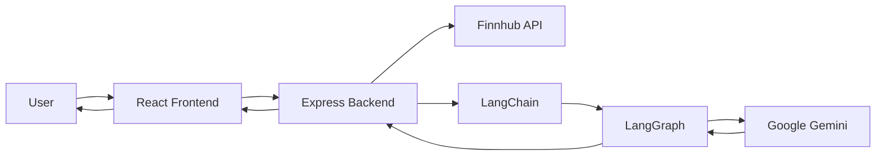
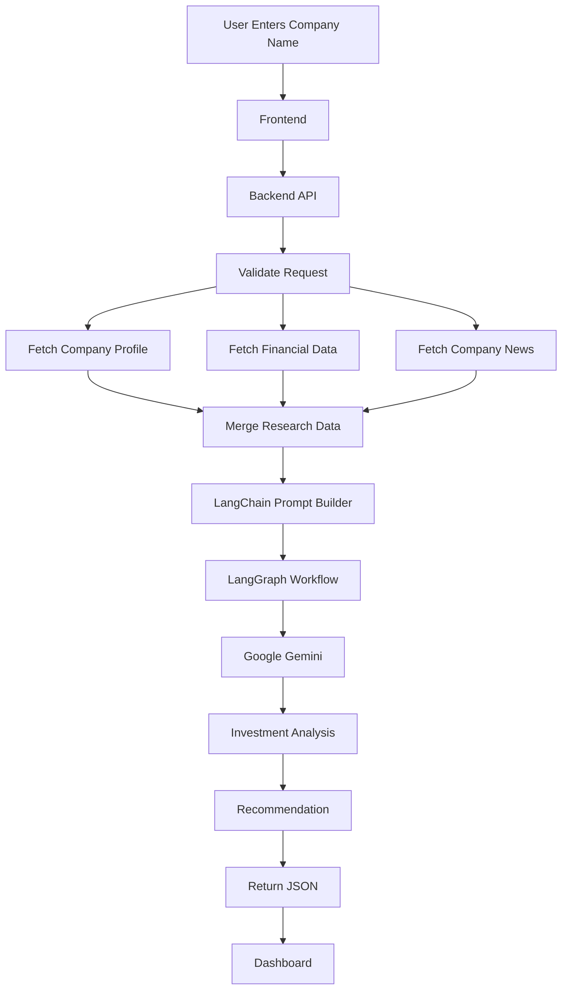
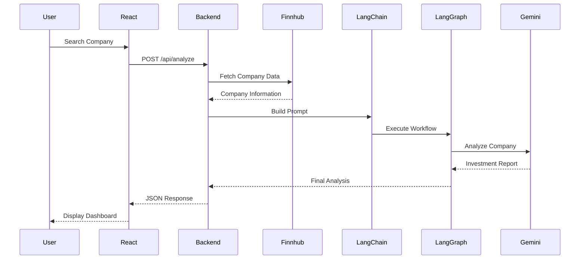
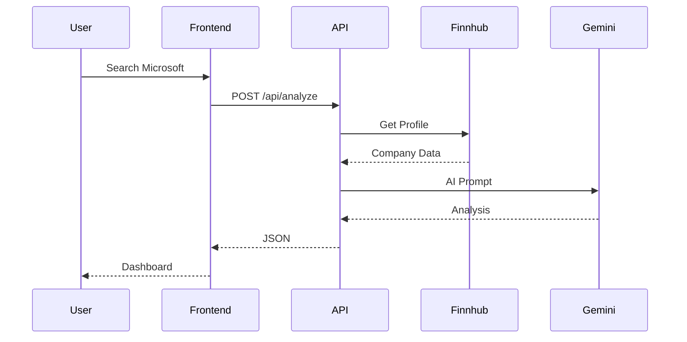
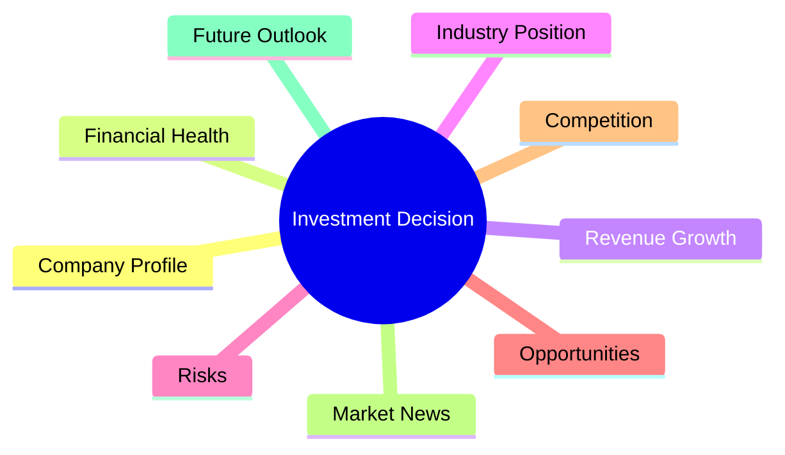

# 🚀 AI Investment Research Agent

<p align="center">


</p>

---

# 📖 Overview

The **AI Investment Research Agent** is an AI-powered web application that automates company research and investment analysis.

Instead of manually reading company profiles, financial statements, and recent news articles, users simply enter a company name. The application gathers relevant information, processes it through an AI workflow powered by **LangChain.js**, **LangGraph.js**, and **Google Gemini**, and produces an easy-to-understand investment recommendation.

The final output explains **whether the company is worth investing in or not**, along with detailed reasoning, opportunities, risks, and supporting evidence.

This project was developed as part of the **InsideIIM × Altuni AI Labs AI Product Development Engineer Internship Assignment**.

---

# ✨ Features

## 🔍 Company Research

- Search any publicly listed company
- Company Profile
- Industry Information
- Market Capitalization
- Exchange Details
- Country
- Website

---

## 📈 Financial Analysis

- Business Overview
- Financial Health
- Revenue Insights
- Growth Analysis
- Risk Assessment

---

## 📰 News Analysis

The application fetches recent company news to understand:

- Current events
- Product launches
- Partnerships
- Earnings
- Market sentiment

---

## 🤖 AI Investment Recommendation

Using **Google Gemini** with **LangChain.js** and **LangGraph.js**, the application generates:

- Investment Recommendation
- Confidence Level
- Strengths
- Weaknesses
- Opportunities
- Risks
- Final Verdict

---

## 🔐 Authentication

- Secure Login
- JWT Authentication
- Demo Login
- Protected Dashboard

---

## 🎨 Modern UI

- Responsive Design
- Professional Dashboard
- Dark Theme
- Fast Performance

---

# 🛠 Tech Stack

## Frontend

- React
- Vite
- Tailwind CSS
- Axios
- React Router

---

## Backend

- Node.js
- Express.js
- JWT Authentication
- bcrypt

---

## AI Stack

- LangChain.js
- LangGraph.js
- Google Gemini

---

## Financial Data

- Finnhub API

---

## Deployment

- Vercel (Frontend)
- Render (Backend)

---

# 📂 Project Structure

```text
AI-Investment-Research-Agent

│
├── frontend
│   │
│   ├── src
│   │   ├── assets
│   │   ├── components
│   │   ├── pages
│   │   ├── services
│   │   ├── hooks
│   │   ├── utils
│   │   ├── App.jsx
│   │   └── main.jsx
│   │
│   └── package.json
│
├── server
│   │
│   ├── controllers
│   ├── middleware
│   ├── routes
│   ├── services
│   │   ├── companyService.js
│   │   ├── geminiService.js
│   │   ├── langchainService.js
│   │   ├── langgraphService.js
│   │   └── promptBuilder.js
│   │
│   ├── utils
│   ├── server.js
│   └── package.json
│
├── README.md
└── .env.example
```

---

# 🏗 High-Level Architecture



---

# 🔄 Complete System Workflow



---

# 🤖 AI Agent Workflow

```mermaid
flowchart TD

Company Name

-->

Research Agent

Research Agent

-->

Company Profile

Research Agent

-->

Financial Data

Research Agent

-->

Latest News

Company Profile

-->

Prompt Builder

Financial Data

-->

Prompt Builder

Latest News

-->

Prompt Builder

Prompt Builder

-->

LangChain

LangChain

-->

LangGraph

LangGraph

-->

Gemini

Gemini

-->

Investment Report

Investment Report

-->

Dashboard
```

---

# 🧠 LangGraph Execution Flow

```mermaid
flowchart LR

Start

-->

Research

-->

Financial Analysis

-->

News Analysis

-->

Prompt Engineering

-->

Gemini AI

-->

Investment Decision

-->

Generate Report

-->

End
```

---

# 🔌 Request Lifecycle



---

# 📊 Investment Decision Pipeline

```mermaid
flowchart LR

Company

-->

Business Quality

-->

Financial Strength

-->

Growth

-->

Market Position

-->

News Sentiment

-->

Risk Assessment

-->

Gemini

-->

Recommendation
```
# ⚙️ Installation Guide

## Prerequisites

Before running the project, ensure you have the following installed:

- Node.js (v18 or above)
- npm
- Git
- A Finnhub API Key
- A Google Gemini API Key

---

## Clone the Repository

```bash
git clone https://github.com/yourusername/AI-Investment-Research-Agent.git

cd AI-Investment-Research-Agent
```

---

## Install Frontend Dependencies

```bash
cd frontend
npm install
```

---

## Install Backend Dependencies

```bash
cd ../server
npm install
```

---

# 🔑 Environment Variables

Create a `.env` file inside the **server** folder.

```env
PORT=5000

JWT_SECRET=your_jwt_secret

GEMINI_API_KEY=your_gemini_api_key

FINNHUB_API_KEY=your_finnhub_api_key

DEMO_EMAIL=demo@example.com

DEMO_PASSWORD=demo123
```

---

## Start Backend

```bash
npm run dev
```

Backend will run on

```
http://localhost:5000
```

---

## Start Frontend

```bash
cd frontend

npm run dev
```

Frontend will run on

```
http://localhost:5173
```

---

# 🚀 Application Flow

```mermaid
flowchart TD

Start

-->

Login

-->

Dashboard

-->

Search Company

-->

Backend API

-->

Collect Financial Data

-->

Collect Company Profile

-->

Collect News

-->

LangChain

-->

LangGraph

-->

Gemini Analysis

-->

Recommendation

-->

Display Dashboard

-->

End
```

---

# 🧩 LangChain Workflow

LangChain is responsible for orchestrating the AI pipeline.

Responsibilities:

- Preparing prompts
- Combining structured financial data
- Formatting company news
- Sending context to Gemini
- Returning structured output

Workflow:

```mermaid
flowchart LR

Financial Data

-->

Prompt Builder

Company News

-->

Prompt Builder

Company Profile

-->

Prompt Builder

Prompt Builder

-->

LangChain

LangChain

-->

Gemini
```

---

# 🧠 LangGraph Workflow

LangGraph manages the execution sequence of different AI tasks.

Each node represents a logical stage.

```mermaid
flowchart TD

Start

-->

Research Node

-->

Financial Node

-->

News Node

-->

Prompt Node

-->

Gemini Node

-->

Recommendation Node

-->

End
```

---

# 📡 API Endpoints

## Authentication

### Register

```
POST /api/auth/register
```

Request

```json
{
  "name":"John",
  "email":"john@example.com",
  "password":"password123"
}
```

---

### Login

```
POST /api/auth/login
```

Request

```json
{
  "email":"john@example.com",
  "password":"password123"
}
```

---

### Demo Login

```
POST /api/auth/demo-login
```

Returns

```json
{
   "token":"JWT_TOKEN"
}
```

---

# Company Analysis

### Analyze Company

```
POST /api/analyze
```

Request

```json
{
   "company":"Apple"
}
```

Example Response

```json
{
   "recommendation":"Invest",

   "confidence":"High",

   "strengths":[
      "Strong revenue",
      "Brand loyalty",
      "Cash reserves"
   ],

   "risks":[
      "Regulatory pressure",
      "Market competition"
   ],

   "summary":"Apple remains a strong long-term investment."
}
```

---

# 🔄 Backend Processing Pipeline

```mermaid
flowchart LR

Client

-->

Express API

-->

Validation

-->

Finnhub

-->

Prompt Builder

-->

LangChain

-->

LangGraph

-->

Gemini

-->

Parser

-->

JSON Response
```

---

# 📥 Request Processing



---

# 🔍 Data Sources

The project gathers information from multiple sources before generating an investment recommendation.

| Source | Purpose |
|---------|----------|
| Finnhub API | Company Profile |
| Finnhub API | Financial Metrics |
| Finnhub API | Market News |
| Google Gemini | Investment Reasoning |
| LangChain | Prompt Orchestration |
| LangGraph | Workflow Management |

---

# 📈 AI Decision Criteria

The recommendation is generated after evaluating several aspects.



---

# 🛡 Error Handling

The application gracefully handles:

- Invalid company names
- Missing API responses
- API rate limits
- Network failures
- Invalid authentication
- Empty requests
- AI generation failures
- Timeout errors

Whenever an error occurs, meaningful feedback is shown to the user instead of exposing server errors.

---

# 📱 Responsive Design

The interface has been optimized for:

- Desktop
- Laptop
- Tablet
- Mobile Devices

The dashboard automatically adjusts layouts to provide the best user experience across different screen sizes.
# 📊 Example Runs

The following examples demonstrate how the AI Investment Research Agent evaluates different companies.

---

## Example 1 — Apple Inc.

### Input

```
Apple
```

### AI Recommendation

✅ **INVEST**

### Analysis Summary

- Strong global brand recognition
- Consistent revenue growth
- Healthy cash reserves
- Strong ecosystem
- Continuous innovation

### Risks

- Regulatory scrutiny
- Dependence on iPhone sales

### Confidence

⭐⭐⭐⭐⭐ (Very High)

---

## Example 2 — Tesla

### Input

```
Tesla
```

### AI Recommendation

🟡 **INVEST WITH CAUTION**

### Analysis Summary

- EV market leader
- Strong long-term growth
- AI and autonomous driving potential
- Premium valuation

### Risks

- High volatility
- Increasing competition
- Margin pressure

### Confidence

⭐⭐⭐⭐☆

---

## Example 3 — NVIDIA

### Input

```
NVIDIA
```

### AI Recommendation

✅ **STRONG INVEST**

### Analysis Summary

- AI market leader
- Strong GPU demand
- Excellent earnings
- Rapid revenue growth

### Risks

- Semiconductor supply chain
- High market expectations

### Confidence

⭐⭐⭐⭐⭐

---

## Example 4 — Microsoft

### Input

```
Microsoft
```

### AI Recommendation

✅ **INVEST**

### Analysis Summary

- Azure cloud growth
- Strong AI investments
- Diversified business
- Stable financial performance

### Risks

- Regulatory challenges
- Cloud competition

### Confidence

⭐⭐⭐⭐⭐

---

# 📸 Screenshots

> Add screenshots of your application here before submission.

Suggested screenshots:

```
screenshots/

├── login.png
├── dashboard.png
├── company-search.png
├── analysis-report.png
├── recommendation.png
└── mobile-view.png
```

Example:

```markdown
## Login


## Dashboard


## Analysis


```

---

# 🚀 Deployment

## Frontend

Hosted on **Vercel**

```
https://your-project.vercel.app
```

---

## Backend

Hosted on **Render**

```
https://your-api.onrender.com
```

---

## Deployment Workflow

```mermaid
flowchart LR

Developer

-->

GitHub

-->

Vercel

Developer

-->

GitHub

-->

Render

Render

-->

Gemini API

Render

-->

Finnhub API

Vercel

-->

User
```

---

# ⚖️ Key Design Decisions

## Why React?

- Fast development
- Component-based architecture
- Excellent ecosystem
- Easy deployment

---

## Why Express.js?

- Lightweight
- Fast API development
- Easy middleware support

---

## Why LangChain?

LangChain provides:

- Prompt templates
- LLM orchestration
- Structured AI pipelines
- Easy integration with Gemini

---

## Why LangGraph?

LangGraph enables:

- Multi-step workflows
- State management
- Agent execution
- Modular reasoning pipeline

---

## Why Gemini?

Google Gemini was selected because:

- Excellent reasoning capability
- Fast response time
- Free API tier
- Good structured output generation

---

## Why Finnhub?

Finnhub provides:

- Company profile
- Financial metrics
- Market news
- Reliable stock information

---

# ⚠ Trade-offs

To complete the assignment within the available time, the following trade-offs were made:

### Included

- AI-powered investment recommendation
- Authentication
- Financial research
- News analysis
- Responsive UI
- Deployment

---

### Left Out

- Portfolio management
- Watchlists
- Historical stock charts
- Real-time streaming prices
- Technical indicators
- Multi-agent collaboration
- Database persistence for search history

---

# 🐞 Challenges Faced

During development, several technical challenges were encountered.

## API Integration

- Finnhub API formatting
- Error handling
- Rate limits

---

## AI Prompt Engineering

- Reducing hallucinations
- Improving recommendation quality
- Formatting AI responses

---

## Deployment

- Environment variables
- Backend deployment
- CORS configuration

---

## Authentication

- JWT validation
- Protected routes
- Demo login implementation

---

## UI Improvements

- Responsive dashboard
- Card layouts
- Loading states
- Error messages

---

# 📈 Performance Optimizations

The application includes several optimizations.

- Modular backend architecture
- Reusable React components
- Efficient API requests
- Loading indicators
- Error boundaries
- Clean separation of concerns

---

# 🔮 Future Improvements

Given more development time, the following features would be added.

## AI Features

- Multi-agent architecture
- Retrieval-Augmented Generation (RAG)
- Historical trend analysis
- Financial ratio calculator
- AI confidence scoring

---

## User Features

- Portfolio tracker
- Watchlist
- Saved analyses
- Export to PDF
- Investment comparison

---

## Visualization

- Interactive stock charts
- Financial dashboards
- Trend graphs
- Risk heatmaps

---

## Backend

- Redis caching
- Queue-based analysis
- Background workers
- API response caching

---

# 🤖 AI Usage

This project was intentionally developed with the assistance of Large Language Models.

AI was used throughout the development lifecycle for:

- Brainstorming ideas
- Designing architecture
- Prompt engineering
- Debugging
- API integration
- UI design improvements
- Deployment troubleshooting
- Documentation generation

Every AI-generated solution was manually reviewed, tested, modified, and integrated into the project.

---

# 💬 LLM Chat Session

The complete development process involved extensive interaction with ChatGPT.

The conversations included:

- Planning the architecture
- React development
- Express backend implementation
- LangChain integration
- LangGraph workflow design
- Gemini prompt engineering
- Deployment
- Bug fixing
- README preparation

The exported conversation logs have been included separately in the submission to demonstrate the complete development process and decision-making approach.

---

# 📚 Lessons Learned

This project strengthened my understanding of:

- AI application development
- Prompt engineering
- LangChain
- LangGraph
- REST API development
- React architecture
- Backend integration
- Authentication
- Cloud deployment
- Production debugging

---

# 🏁 Conclusion

The AI Investment Research Agent successfully demonstrates how modern AI technologies can automate investment research by combining financial data, recent news, and large language models into a single intelligent workflow.

The project showcases practical software engineering practices, clean architecture, modular design, AI orchestration with LangChain and LangGraph, and deployment using modern cloud platforms.

Beyond fulfilling the assignment requirements, the project was designed to be scalable and extensible, making it a solid foundation for future AI-powered financial analysis tools.

---

# 🙏 Acknowledgements

Special thanks to:

- InsideIIM
- Altuni AI Labs
- Google Gemini
- LangChain
- LangGraph
- Finnhub
- React Community
- Express.js Community

---

# 📄 License

This project was created as part of the **InsideIIM × Altuni AI Labs AI Product Development Engineer Internship Assignment**.

It is intended for educational and evaluation purposes only.

---

# 👨‍💻 Author

**Ayush Pandey**

B.Tech – Computer Science & Engineering

Lovely Professional University

---

⭐ If you found this project interesting, feel free to give it a star on GitHub!
