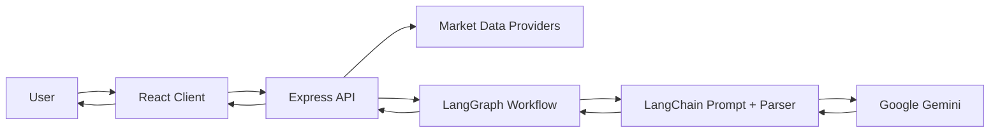
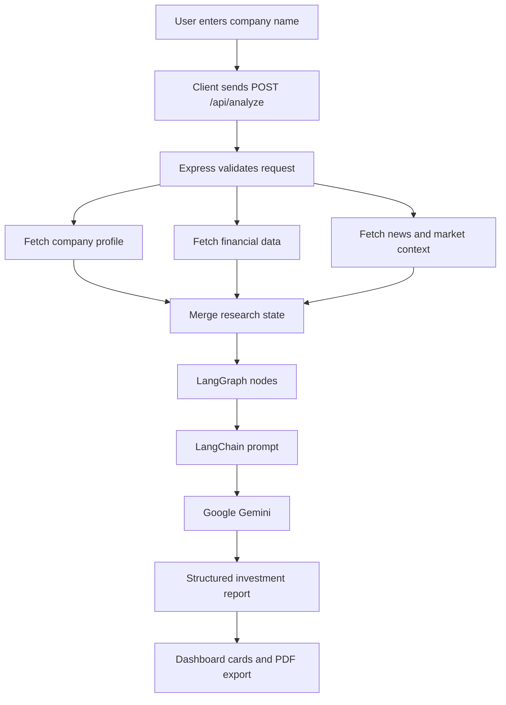
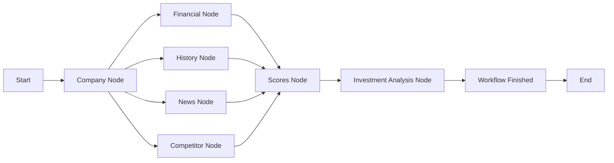
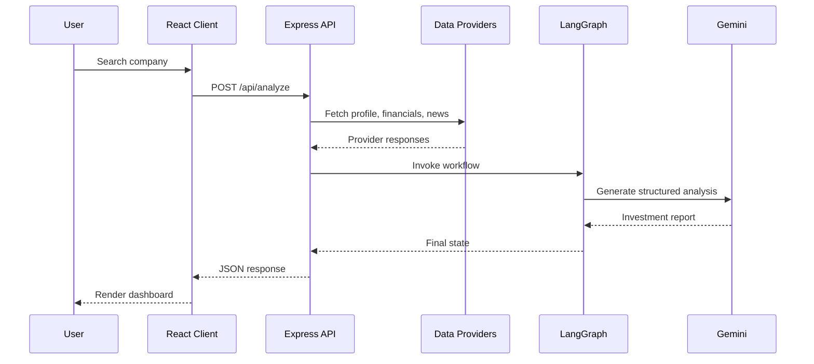

# AI Investment Research Agent

<p align="center">
  
  
  
  
  
  
</p>

AI Investment Research Agent is a full-stack web application that automates company research and produces AI-assisted investment analysis. Users enter a company name or ticker, the backend gathers market data and news, and a LangGraph workflow uses Google Gemini to generate a structured investment report.

> This project is for educational and evaluation purposes only. It is not financial advice.

## Table Of Contents

- [Overview](#overview)
- [Features](#features)
- [Tech Stack](#tech-stack)
- [Project Structure](#project-structure)
- [Architecture](#architecture)
- [Workflow](#workflow)
- [Getting Started](#getting-started)
- [Environment Variables](#environment-variables)
- [API Endpoints](#api-endpoints)
- [Deployment](#deployment)
- [Design Decisions](#design-decisions)
- [Trade-Offs](#trade-offs)
- [Future Improvements](#future-improvements)
- [Author](#author)

## Overview

The application helps users evaluate public companies by combining:

- Company profile data
- Financial metrics
- Historical chart data
- Recent market news
- AI-generated reasoning
- Investment score and recommendation
- SWOT and risk analysis

The final dashboard presents the output in a readable format with export-ready report sections.

## Features

### Company Research

- Search public companies by name or ticker
- Display company profile information
- Show industry, exchange, country, and website details
- Surface competitor and market context

### Financial Analysis

- Financial health overview
- Revenue and growth insights
- Risk assessment
- Market and valuation context

### News Analysis

- Fetches recent company and market news
- Highlights important events
- Supports sentiment-aware AI reasoning

### AI Investment Recommendation

The AI workflow generates:

- Recommendation: BUY, HOLD, or SELL
- Investment score
- Summary and final verdict
- Strengths, weaknesses, opportunities, and threats
- Risk and valuation commentary

### Demo Authentication

- Demo-only login flow
- JWT-based session
- Protected dashboard and profile routes
- No database dependency required

### Modern UI

- React dashboard
- Responsive layout
- Dark and light mode support
- Animated but optimized background visuals
- PDF export support

## Tech Stack

| Layer | Tools |
| --- | --- |
| Frontend | React, Vite, Tailwind CSS, Framer Motion, Recharts, Axios |
| Backend | Node.js, Express.js, JWT |
| AI | LangChain.js, LangGraph.js, Google Gemini |
| Data Providers | Finnhub, FMP, Alpha Vantage, Twelve Data, NewsAPI, Marketaux |
| Export | html2canvas, jsPDF |
| Deployment | Render-compatible backend, Vite-compatible frontend |

## Project Structure

```text
AI Investment/
|-- client/
|   |-- public/
|   |-- src/
|   |   |-- assets/
|   |   |-- components/
|   |   |-- context/
|   |   |-- pages/
|   |   |-- services/
|   |   |-- utils/
|   |   |-- App.jsx
|   |   `-- main.jsx
|   |-- .env.example
|   `-- package.json
|-- server/
|   |-- src/
|   |   |-- auth/
|   |   |-- chains/
|   |   |-- config/
|   |   |-- controllers/
|   |   |-- graph/
|   |   |-- middleware/
|   |   |-- nodes/
|   |   |-- prompts/
|   |   |-- providers/
|   |   |-- routes/
|   |   |-- services/
|   |   `-- utils/
|   |-- .env.example
|   |-- app.js
|   |-- server.js
|   `-- package.json
|-- scripts/
|-- package.json
`-- README.md
```

## Architecture



## Workflow



## LangGraph Execution



## Request Lifecycle



## Getting Started

### Prerequisites

- Node.js 20 or newer recommended
- npm
- Git
- Google Gemini API key
- At least one market data provider key

### Clone The Repository

```bash
git clone https://github.com/yourusername/AI-Investment-Research-Agent.git
cd AI-Investment-Research-Agent
```

### Install Dependencies

Install all workspace dependencies:

```bash
npm install --prefix client
npm install --prefix server
```

### Configure Environment

Create a server environment file:

```bash
cp server/.env.example server/.env
```

Create a client environment file:

```bash
cp client/.env.example client/.env
```

Update the values in both files before starting the app.

### Run In Development

Start both client and server from the project root:

```bash
npm run dev
```

Or run them separately:

```bash
npm run dev:server
npm run dev:client
```

Default URLs:

- Frontend: `http://localhost:5173`
- Backend: `http://localhost:5000`

### Build The Client

```bash
npm run build
```

## Environment Variables

### Server

Create `server/.env`:

```env
PORT=5000
NODE_ENV=development
JWT_SECRET=replace_with_a_long_random_secret
JWT_EXPIRES_IN=7d
DEMO_USER_EMAIL=demo@ai-investment.local
DEMO_USER_NAME=Demo Analyst

API_REQUEST_TIMEOUT_MS=10000
API_REQUEST_RETRIES=2

FINNHUB_API_KEY=your_finnhub_api_key_here
FMP_API_KEY=your_financial_modeling_prep_api_key_here
ALPHA_VANTAGE_API_KEY=your_alpha_vantage_api_key_here
TWELVE_DATA_API_KEY=your_twelve_data_api_key_here

NEWS_API_KEY=your_newsapi_api_key_here
MARKETAUX_API_KEY=your_marketaux_api_key_here

GEMINI_API_KEY=your_gemini_api_key_here
GEMINI_MODEL=gemini-2.5-flash

OPENROUTER_API_KEY=your_openrouter_api_key_here
OPENROUTER_MODEL=openai/gpt-4o-mini

GROQ_API_KEY=your_groq_api_key_here
GROQ_MODEL=llama-3.1-8b-instant
```

Generate a secure JWT secret with:

```bash
node -e "console.log(require('crypto').randomBytes(64).toString('hex'))"
```

### Client

Create `client/.env`:

```env
VITE_API_BASE_URL=http://localhost:5000
```

For production, set `VITE_API_BASE_URL` to your deployed backend URL.

## API Endpoints

### Health Check

```http
GET /
```

### Demo Login

```http
POST /api/auth/demo
```

Example response:

```json
{
  "success": true,
  "token": "JWT_TOKEN",
  "user": {
    "id": "demo-user",
    "name": "Demo Analyst",
    "email": "demo@ai-investment.local",
    "avatar": "",
    "authProvider": "demo"
  }
}
```

### Current User

```http
GET /api/auth/me
Authorization: Bearer JWT_TOKEN
```

### Analyze Company

```http
POST /api/analyze
Content-Type: application/json
```

Request:

```json
{
  "company": "Apple"
}
```

### Chart Data

```http
GET /api/chart/:symbol
```

Example:

```http
GET /api/chart/AAPL
```

### Company Search

```http
GET /api/search?query=apple
```

## Data Sources

| Source | Purpose |
| --- | --- |
| Finnhub | Company profile, financial metrics, market data |
| FMP | Financial data fallback |
| Alpha Vantage | Market data fallback |
| Twelve Data | Chart and quote data |
| NewsAPI | Company news |
| Marketaux | Market news fallback |
| Google Gemini | Investment reasoning and report generation |

## Error Handling

The application handles:

- Empty company input
- Invalid symbols
- Missing provider API keys
- Provider rate limits
- Network failures
- AI generation errors
- Invalid or expired JWT sessions

User-facing errors are shown through toast messages and dashboard states.

## Deployment

### Backend On Render

Use the `server` folder as the service root if Render asks for one.

Recommended settings:

```text
Build Command: npm install
Start Command: npm start
```

Required backend environment variables:

```env
NODE_ENV=production
JWT_SECRET=your_generated_secret
JWT_EXPIRES_IN=7d
GEMINI_API_KEY=your_gemini_api_key
```

Add provider keys for richer results:

```env
FINNHUB_API_KEY=...
FMP_API_KEY=...
ALPHA_VANTAGE_API_KEY=...
TWELVE_DATA_API_KEY=...
NEWS_API_KEY=...
MARKETAUX_API_KEY=...
```

MongoDB is not required for the current demo-only version.

### Frontend

Deploy the `client` folder to any Vite-compatible host.

Recommended settings:

```text
Build Command: npm install && npm run build
Publish Directory: dist
```

Set:

```env
VITE_API_BASE_URL=https://your-backend.onrender.com
```

## Design Decisions

### React And Vite

React and Vite provide a fast UI development workflow, strong component composition, and straightforward production builds.

### Express API

Express keeps the backend lightweight while making it easy to organize routes, controllers, middleware, and provider services.

### LangChain And LangGraph

LangChain handles prompt composition and structured parsing. LangGraph coordinates the multi-step investment workflow through dedicated nodes for company data, financials, news, competitors, scores, and final AI analysis.

### Demo-Only Authentication

The app uses a fixed demo user and JWT sessions. This keeps deployment simple and removes the need for a database while preserving protected routes.

## Trade-Offs

Included:

- AI-assisted investment recommendation
- Demo authentication
- Company profile, financial, news, and competitor research
- Responsive dashboard
- PDF export
- Cloud-deployable backend and frontend

Not included:

- User registration
- Persistent user accounts
- Watchlists
- Portfolio tracking
- Saved search history
- Real-time streaming prices
- Database-backed analytics

## Future Improvements

- Portfolio tracker
- Watchlists and saved reports
- Historical trend analysis
- Technical indicators
- Caching for provider responses
- Queue-based analysis jobs
- More detailed confidence scoring
- Side-by-side company comparison
- Database persistence for production users

## AI Usage

Large language models were used during development for brainstorming, architecture planning, prompt engineering, debugging, UI iteration, deployment troubleshooting, and documentation drafting. All generated output was reviewed and adapted before integration.

## Lessons Learned

This project strengthened practical understanding of:

- AI application development
- Prompt engineering
- LangChain and LangGraph orchestration
- REST API design
- React dashboard architecture
- Provider API integration
- JWT authentication
- Cloud deployment
- Production debugging

## Acknowledgements

- InsideIIM
- Altuni AI Labs
- Google Gemini
- LangChain
- LangGraph
- React community
- Express.js community

## License

This project was created for educational and evaluation purposes as part of the InsideIIM x Altuni AI Labs AI Product Development Engineer Internship Assignment.

## Author

**Ayush Pandey**  
B.Tech, Computer Science and Engineering  
Lovely Professional University
